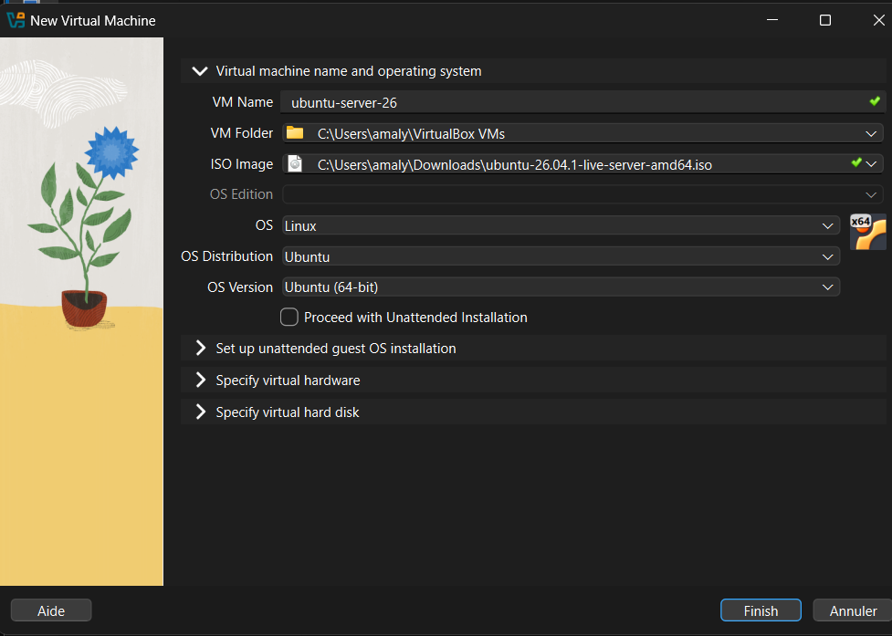
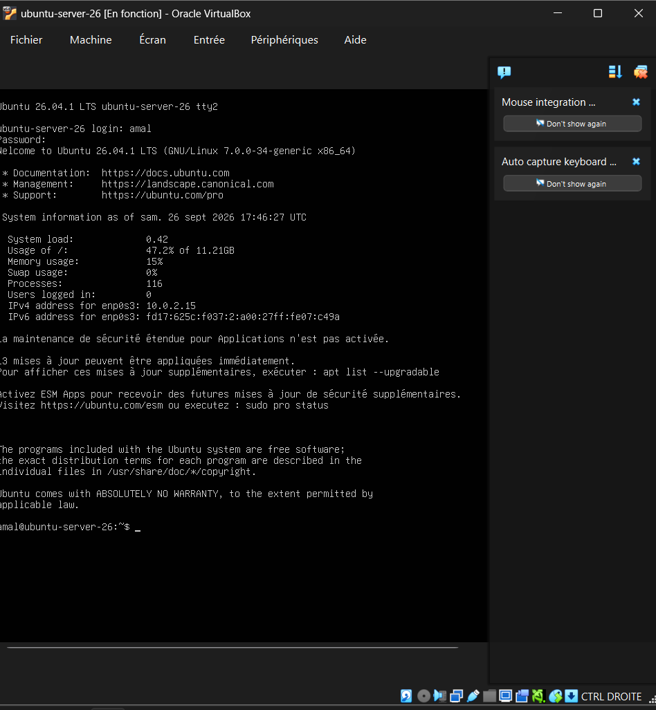
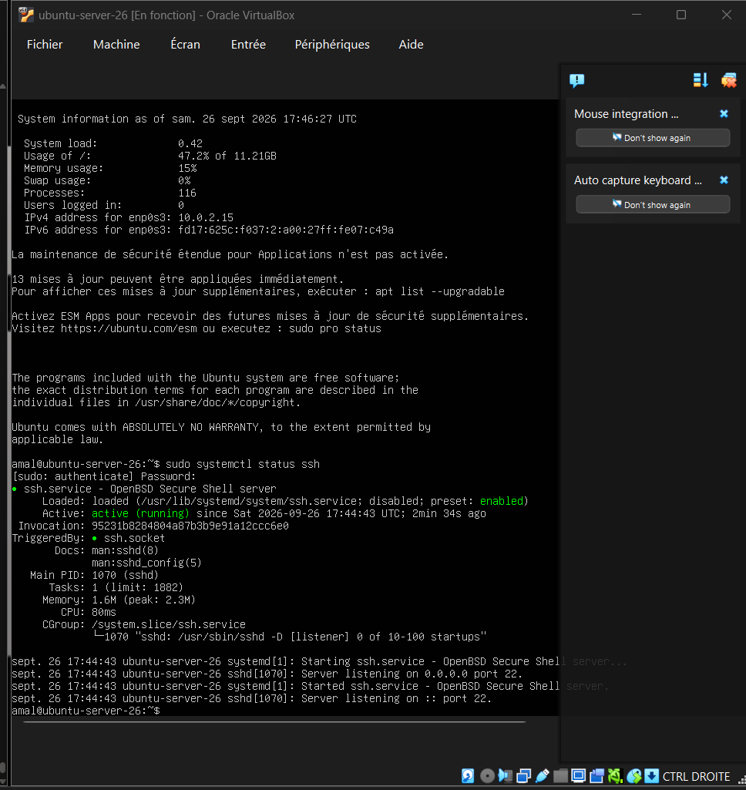
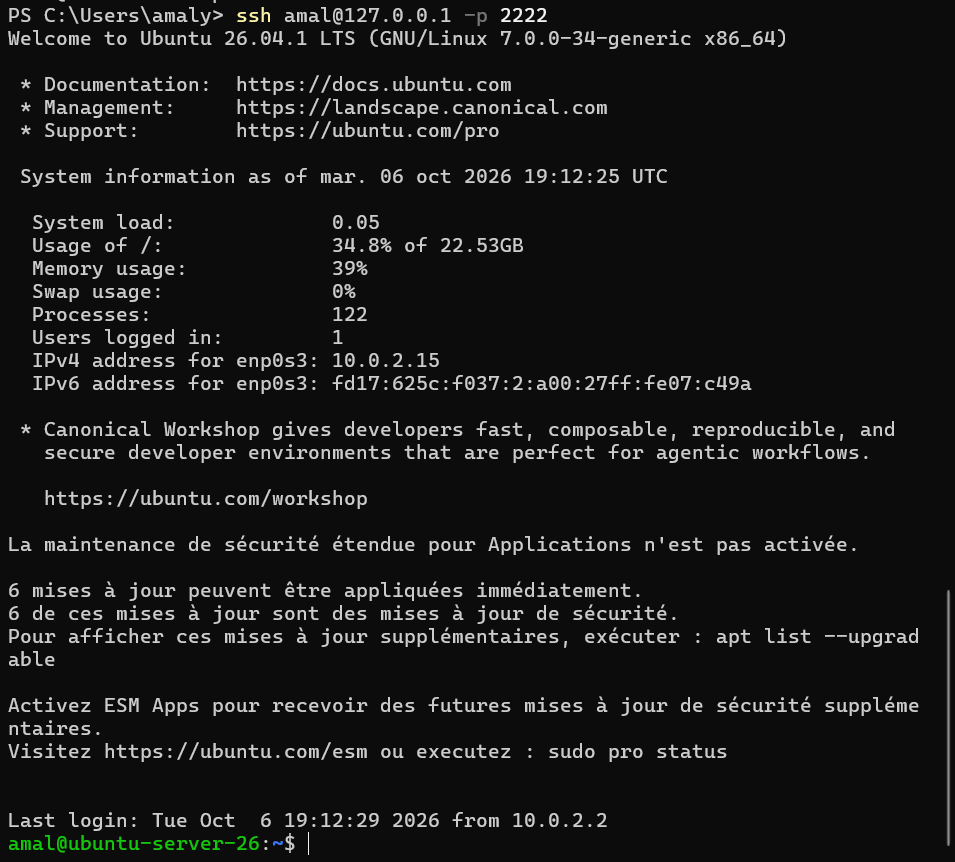
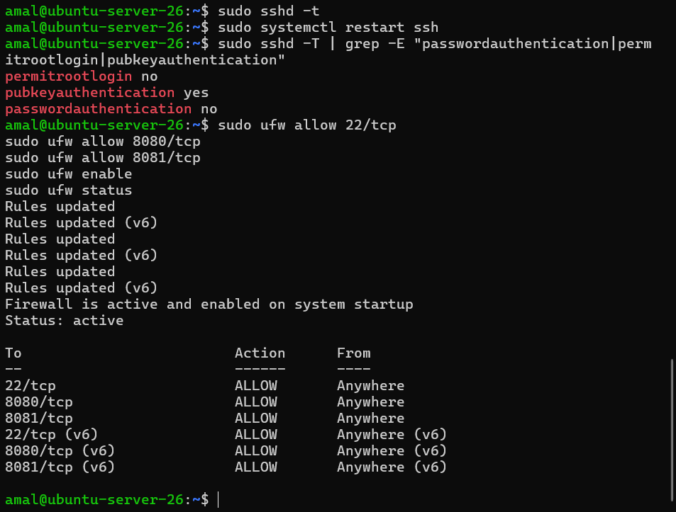
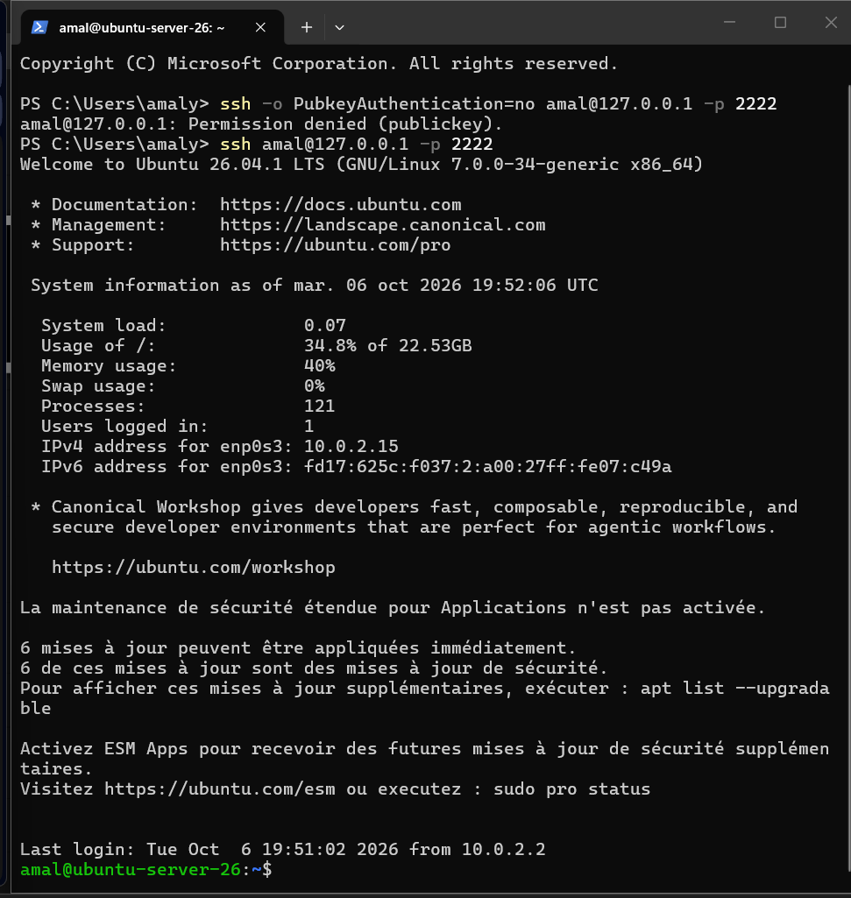

# Étape 1 – Installation d'Ubuntu Server 26.04 et accès SSH

## Création de la VM

- Hyperviseur : VirtualBox
- Nom de la VM : `ubuntu-server-26`
- ISO : `ubuntu-26.04.1-live-server-amd64.iso`
- OS : Linux / Ubuntu (64-bit)



## Première connexion

Après l'installation, connexion à la VM avec l'utilisateur `amal`. La VM est en mode NAT (adresse `10.0.2.15`).



## Configuration de l'accès SSH

Vérification que le service SSH (OpenSSH) est actif et écoute sur le port 22 :

```bash
sudo systemctl status ssh
```

Le service est `active (running)` et écoute sur `0.0.0.0:22` et `:::22`.



## Sécurisation de l'accès SSH par clé

Depuis la machine physique (PowerShell), génération d'une clé ED25519 :

```powershell
ssh-keygen -t ed25519 -C "amal-vm" -f $env:USERPROFILE\.ssh\id_ed25519 -N '""'
```

Envoi de la clé publique vers la VM (le mot de passe est demandé une dernière fois) :

```powershell
type $env:USERPROFILE\.ssh\id_ed25519.pub | ssh amal@127.0.0.1 -p 2222 "mkdir -p ~/.ssh && cat >> ~/.ssh/authorized_keys && chmod 700 ~/.ssh && chmod 600 ~/.ssh/authorized_keys"
```

Test de la connexion :

```powershell
ssh amal@127.0.0.1 -p 2222
```

La connexion s'établit directement, **sans mot de passe** : l'authentification par clé fonctionne.


## Durcissement de la configuration SSH

Création d'un fichier de configuration dédié, lu avant `sshd_config` :

```bash
printf "PermitRootLogin no\nPubkeyAuthentication yes\nPasswordAuthentication no\n" | sudo tee /etc/ssh/sshd_config.d/01-hardening.conf
sudo sshd -t
sudo systemctl restart ssh
sudo sshd -T | grep -E "passwordauthentication|permitrootlogin|pubkeyauthentication"
```

- `PermitRootLogin no` : la connexion directe en root est interdite.
- `PubkeyAuthentication yes` : l'authentification par clé est activée.
- `PasswordAuthentication no` : l'authentification par mot de passe est désactivée.

## Pare-feu (UFW)

```bash
sudo ufw allow 22/tcp
sudo ufw allow 8080/tcp
sudo ufw allow 8081/tcp
sudo ufw enable
sudo ufw status
```

Seuls les ports SSH (22), Jenkins (8080) et le Portfolio (8081) sont autorisés.



## Test : le mot de passe est refusé

Depuis la machine physique (PowerShell) :

```powershell
ssh -o PubkeyAuthentication=no amal@127.0.0.1 -p 2222
```

La connexion est rejetée avec `Permission denied (publickey)` : seule la clé est acceptée.

