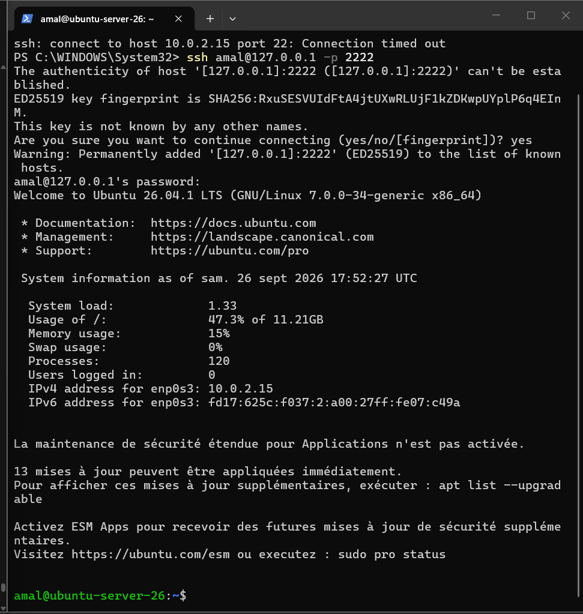

# Étape 2 – Test de l'accès SSH depuis la machine physique

## Principe

La VM est en mode NAT : sa propre adresse (`10.0.2.15`) n'est pas joignable directement depuis la machine physique (la connexion vers `10.0.2.15:22` expire : *Connection timed out*).

On utilise donc une **redirection de port** VirtualBox :

| Hôte (machine physique) | Invité (VM) |
|---|---|
| `127.0.0.1:2222` | `10.0.2.15:22` |

## Connexion

Depuis PowerShell sur la machine physique :

```bash
ssh amal@127.0.0.1 -p 2222
```

À la première connexion, l'empreinte de la clé du serveur (ED25519) est acceptée avec `yes`, puis le mot de passe de l'utilisateur est demandé.

## Résultat

La connexion réussit : on obtient le prompt `amal@ubuntu-server-26:~$`.


