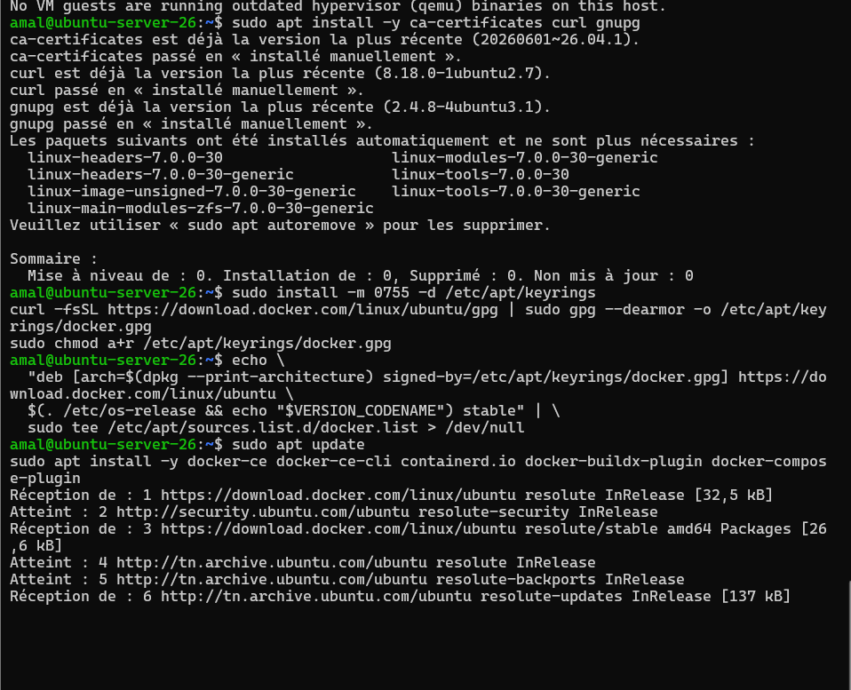
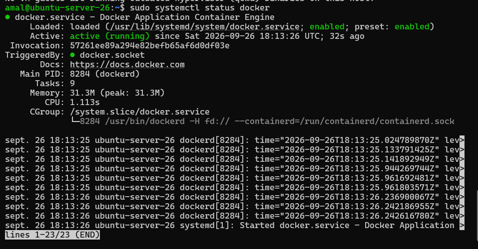
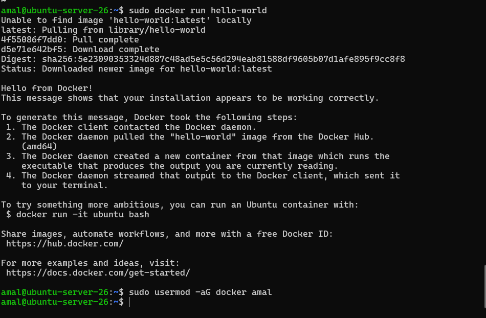
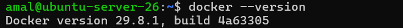

# Étape 3 – Installation de Docker sur la VM

## 1. Ajout du dépôt officiel Docker

```bash
sudo apt install -y ca-certificates curl gnupg
sudo install -m 0755 -d /etc/apt/keyrings
curl -fsSL https://download.docker.com/linux/ubuntu/gpg | sudo gpg --dearmor -o /etc/apt/keyrings/docker.gpg
sudo chmod a+r /etc/apt/keyrings/docker.gpg
echo \
  "deb [arch=$(dpkg --print-architecture) signed-by=/etc/apt/keyrings/docker.gpg] https://download.docker.com/linux/ubuntu \
  $(. /etc/os-release && echo "$VERSION_CODENAME") stable" | \
  sudo tee /etc/apt/sources.list.d/docker.list > /dev/null
```

## 2. Installation des paquets Docker

```bash
sudo apt update
sudo apt install -y docker-ce docker-ce-cli containerd.io docker-buildx-plugin docker-compose-plugin
```



## 3. Vérification du service

```bash
sudo systemctl status docker
```

Le service `docker.service` est `active (running)` et `enabled`.



## 4. Test avec hello-world

```bash
sudo docker run hello-world
```

Le message « Hello from Docker! » confirme que l'installation fonctionne.



## 5. Utiliser Docker sans sudo

```bash
sudo usermod -aG docker amal
```

(Se reconnecter pour que le changement de groupe soit pris en compte.)

## 6. Version installée

```bash
docker --version
```


