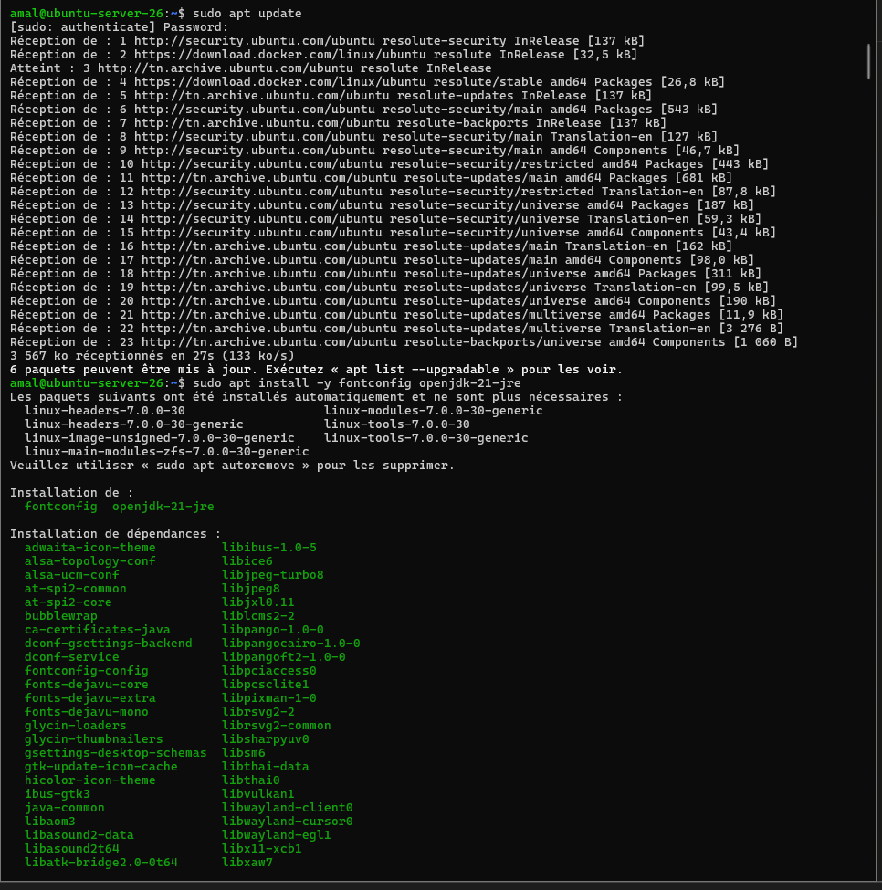
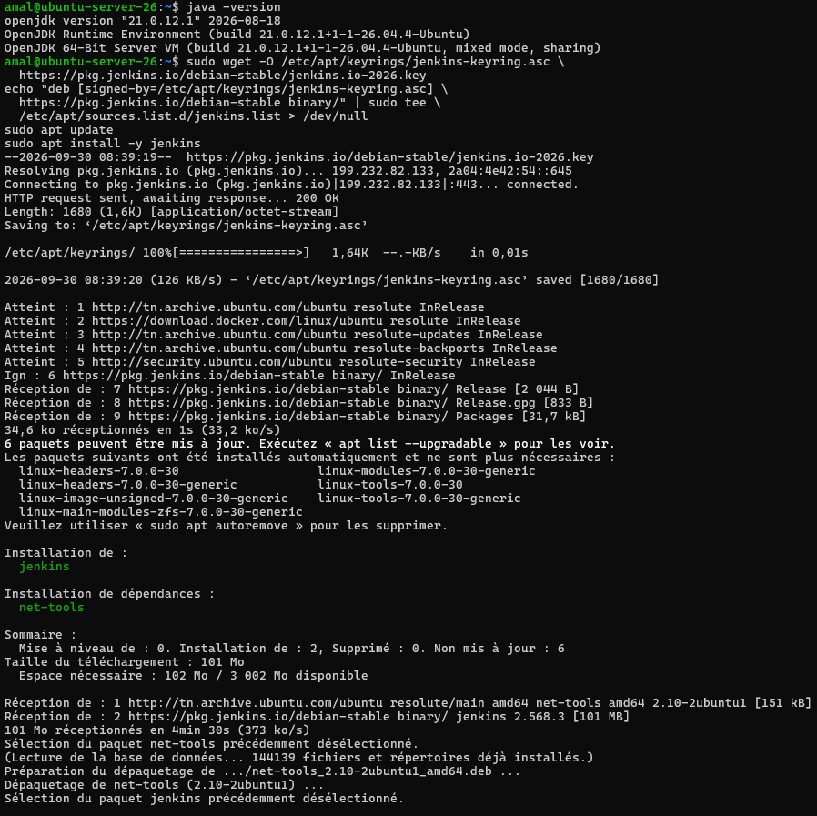
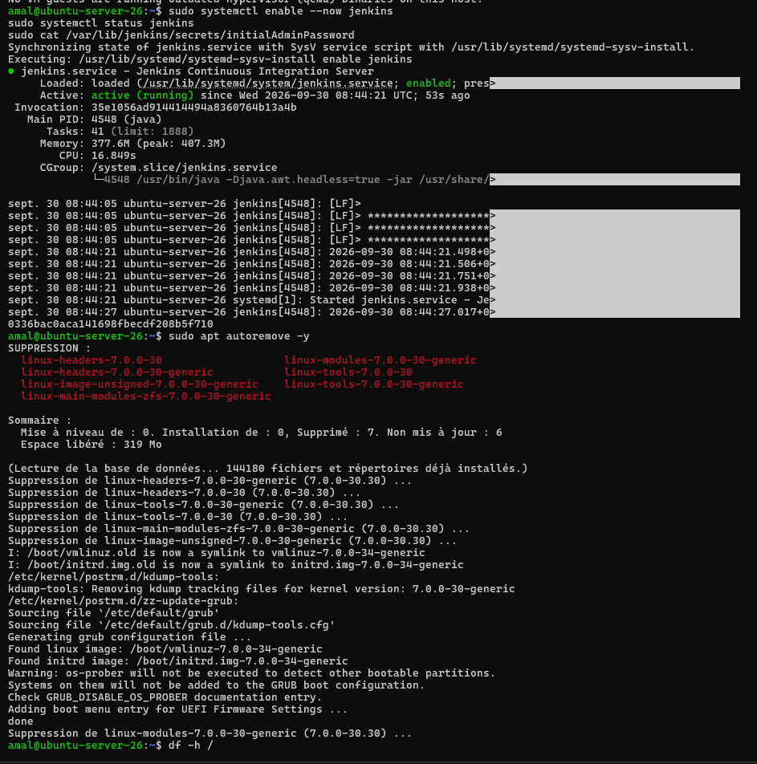
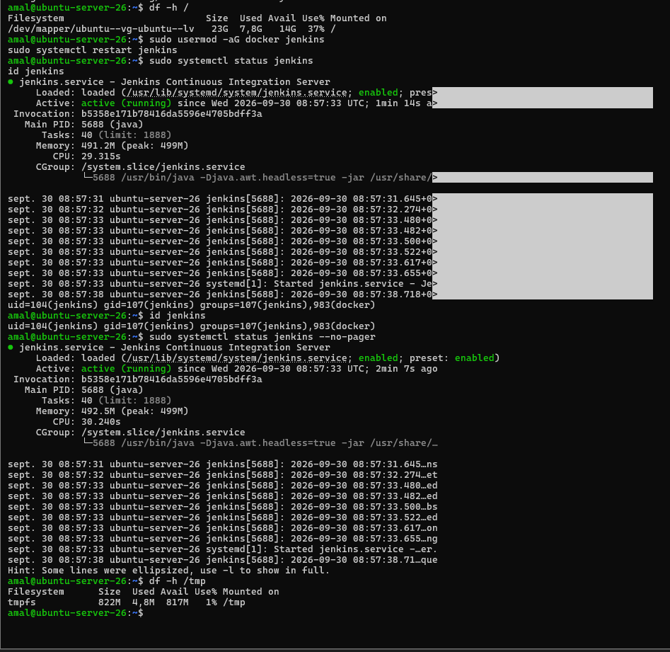
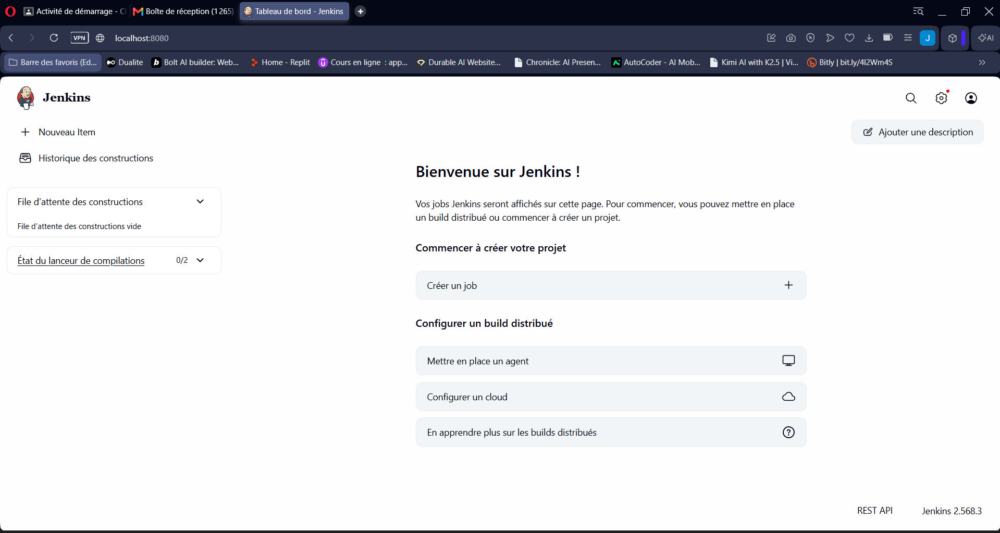

# Étape 4 – Installation de Jenkins en tant que service

## 1. Prérequis : Java

```bash
sudo apt update
sudo apt install -y fontconfig openjdk-21-jre
java -version
```



## 2. Ajout du dépôt Jenkins et installation

```bash
sudo wget -O /etc/apt/keyrings/jenkins-keyring.asc https://pkg.jenkins.io/debian-stable/jenkins.io-2026.key
echo "deb [signed-by=/etc/apt/keyrings/jenkins-keyring.asc] https://pkg.jenkins.io/debian-stable binary/" | sudo tee /etc/apt/sources.list.d/jenkins.list > /dev/null
sudo apt update
sudo apt install -y jenkins
```



## 3. Activation et démarrage du service

```bash
sudo systemctl enable --now jenkins
sudo systemctl status jenkins
```

Le service `jenkins.service` est `active (running)` et `enabled`.



## 4. Droits Docker pour Jenkins et vérification

```bash
sudo usermod -aG docker jenkins
sudo systemctl restart jenkins
id jenkins
sudo systemctl status jenkins --no-pager
```

L'utilisateur `jenkins` appartient bien au groupe `docker` et le service est de nouveau `active (running)`.



## 5. Vérification depuis la machine physique

Une redirection de port VirtualBox (hôte `localhost:8080` → VM `8080`) permet d'accéder à Jenkins depuis le navigateur de la machine physique :

```
http://localhost:8080
```

La page d'accueil « Bienvenue sur Jenkins ! » s'affiche (Jenkins 2.568.3), ce qui confirme que le service fonctionne correctement.


