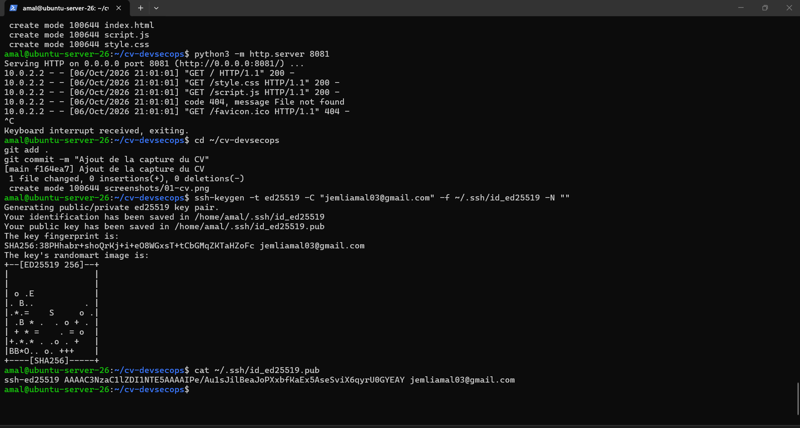
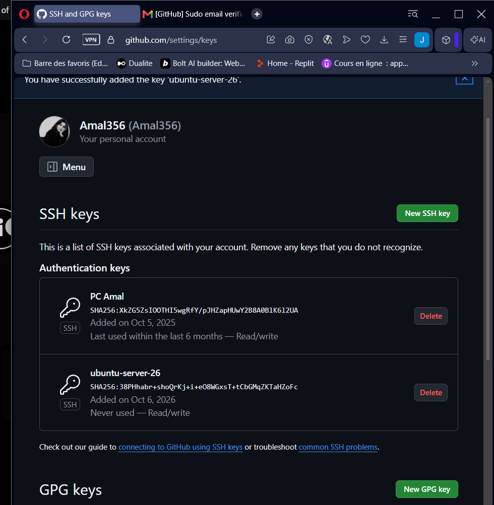
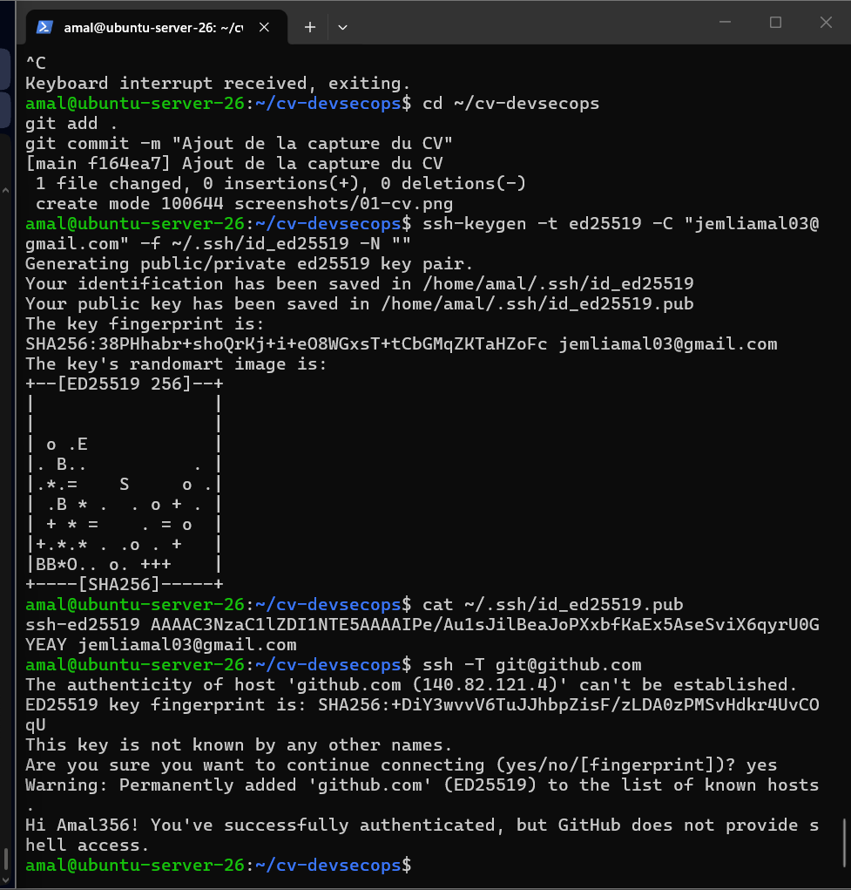
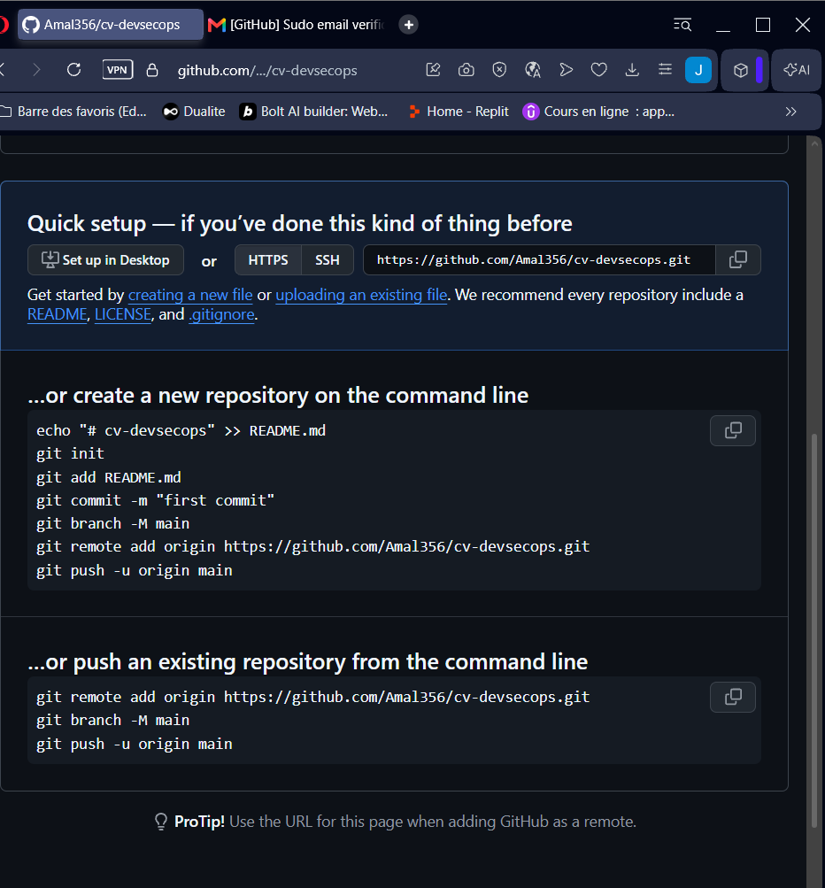
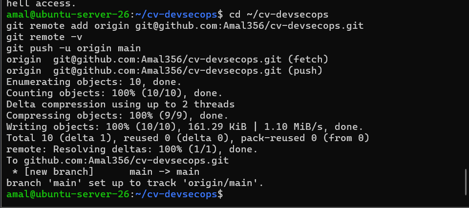

# Étape 6 – Push GitHub via SSH

Dépôt : https://github.com/Amal356/cv-devsecops

## 1. Génération de la clé SSH (dans la VM)

```bash
ssh-keygen -t ed25519 -C "jemliamal03@gmail.com" -f ~/.ssh/id_ed25519 -N ""
cat ~/.ssh/id_ed25519.pub
```

La clé publique (`id_ed25519.pub`) est celle qu'on donne à GitHub. La clé privée (`id_ed25519`) reste sur la VM et n'est jamais partagée.



## 2. Ajout de la clé publique sur GitHub

1. GitHub → **Settings** → **SSH and GPG keys**
2. **New SSH key**
3. Titre : `ubuntu-server-26`, type : *Authentication Key*
4. Coller la clé publique (la ligne qui commence par `ssh-ed25519`)
5. **Add SSH key**

GitHub confirme l'ajout, et l'empreinte affichée est la même que celle générée dans la VM.



## 3. Test de la connexion SSH

```bash
ssh -T git@github.com
```

À la première connexion, l'empreinte du serveur GitHub est acceptée avec `yes`. Le message obtenu confirme l'authentification :

```
Hi Amal356! You've successfully authenticated, but GitHub does not provide shell access.
```



## 4. Création du dépôt GitHub

Dépôt `cv-devsecops`, public, créé vide (sans README, `.gitignore` ni licence).



## 5. Configuration du dépôt local pour utiliser SSH

```bash
cd ~/cv-devsecops
git remote add origin git@github.com:Amal356/cv-devsecops.git
git remote -v
git push -u origin main
```

L'adresse du dépôt distant commence par `git@github.com:` (SSH) et non par `https://`. Aucun mot de passe n'est demandé au push : la clé SSH authentifie la connexion.


