# DevSecOps Portfolio – Amal Jemli

Dépôt GitHub : https://github.com/Amal356/cv-devsecops

Le mini CV de l'étape 5 a évolué en petite application de portfolio (HTML5, CSS3, JavaScript).

## Étape 5 – Mini CV One Page

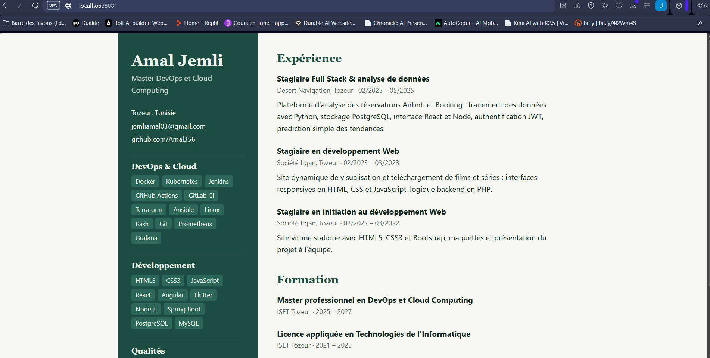

## Étape 7 – Évolution vers un DevSecOps Portfolio

Sections : **About, Skills, DevSecOps Skills, Projects, Experience, Contact**.

Principales améliorations :

- barre de navigation fixe avec liens d'ancrage vers chaque section et défilement doux ;
- page découpée en sections au lieu d'un CV en deux colonnes ;
- thème clair / sombre, mémorisé dans le navigateur, qui suit aussi la préférence du système ;
- mise en page adaptée aux petits écrans (responsive) ;
- contenu des projets séparé de la mise en page, dans le code JavaScript.

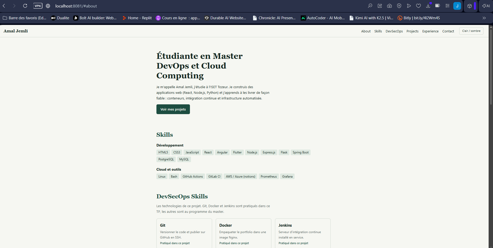

## Étape 8 – Section DevSecOps Skills

Technologies du projet : Git, Docker, Jenkins, Kubernetes, Ansible, Terraform, Argo CD.
Git, Docker et Jenkins sont marqués « Pratiqué dans ce projet », les autres « Au programme ».

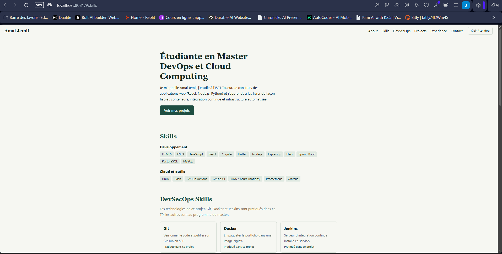

## Étape 9 – Projects générés dynamiquement en JavaScript

Les projets sont décrits dans un tableau d'objets, puis la page est construite par une fonction :

```javascript
const projets = [
  {
    titre: "Plateforme d'analyse des réservations",
    periode: "2025 · Desert Navigation",
    description: "Analyse des réservations Airbnb et Booking ...",
    technologies: ["Python", "PostgreSQL", "React", "Node.js", "JWT"]
  },
  // ...
];

function creerProjet(p) {
  const bloc = document.createElement("article");
  const titre = document.createElement("h3");
  titre.textContent = p.titre;
  // ... description, technologies, lien
  bloc.append(titre /* ... */);
  return bloc;
}

document.getElementById("project-list").append(...projets.map(creerProjet));
```

Ajouter un projet revient à ajouter un objet au tableau.

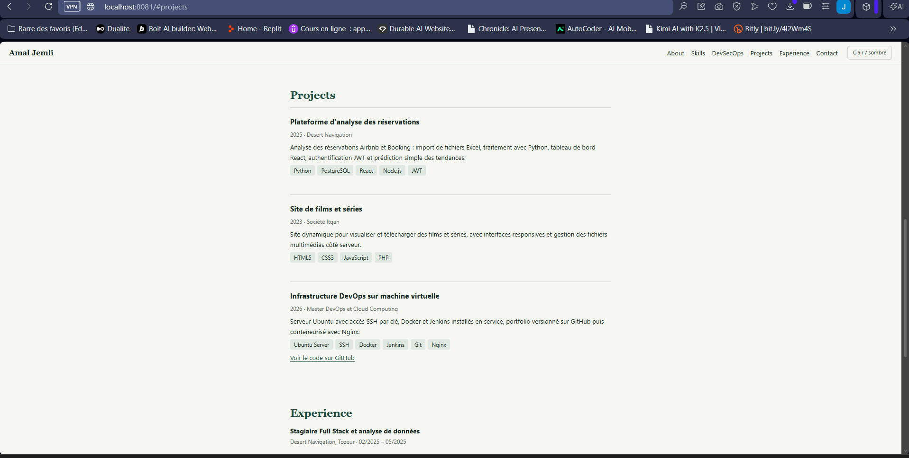

## Étape 10 – Dockerfile (Nginx)

Fichier `Dockerfile` à la racine du projet :

```dockerfile
# Image officielle Nginx, version légère (Alpine Linux)
FROM nginx:alpine

# Copie du site statique dans le dossier servi par Nginx
COPY index.html style.css script.js /usr/share/nginx/html/

# Nginx écoute sur le port 80 dans le conteneur
EXPOSE 80
```

Explication :

- `FROM nginx:alpine` : l'image de départ est Nginx sur Alpine Linux, une base très légère (quelques dizaines de Mo).
- `COPY ...` : les trois fichiers du portfolio sont copiés dans `/usr/share/nginx/html/`, le dossier que Nginx sert par défaut. Le portfolio est un site statique, il n'y a donc rien à compiler.
- `EXPOSE 80` : indique que le conteneur écoute sur le port 80. La publication vers la machine se fait ensuite avec `-p` ou Docker Compose.

Un fichier `.dockerignore` exclut du build ce qui n'est pas utile au site (`.git`, `screenshots`, `README.md`, `Dockerfile`, `docker-compose.yml`).

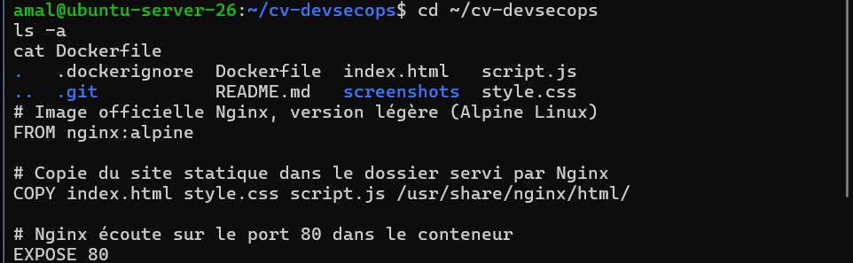

## Étape 11 – Construction de l'image `cv-docker`

```bash
docker build -t cv-docker .
docker images
```

`-t cv-docker` donne le nom `cv-docker` à l'image (tag `latest` par défaut) et `.` indique que le contexte de build est le dossier courant.

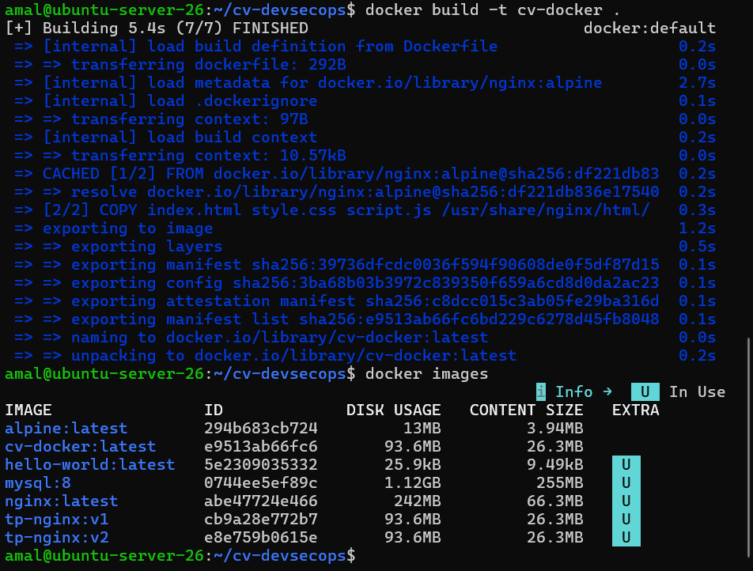

## Étape 12 – Exécution du conteneur

```bash
docker run -d --name cv -p 8081:80 cv-docker
docker ps
```

- `-d` : le conteneur tourne en arrière-plan ;
- `--name cv` : nom du conteneur ;
- `-p 8081:80` : le port 8081 de la VM est relié au port 80 de Nginx dans le conteneur.

Résultat de `docker ps` :

```
CONTAINER ID   IMAGE       COMMAND                  CREATED         STATUS         PORTS                                         NAMES
ae8f56711996   cv-docker   "/docker-entrypoint.…"   7 seconds ago   Up 6 seconds   0.0.0.0:8081->80/tcp, [::]:8081->80/tcp       cv
```

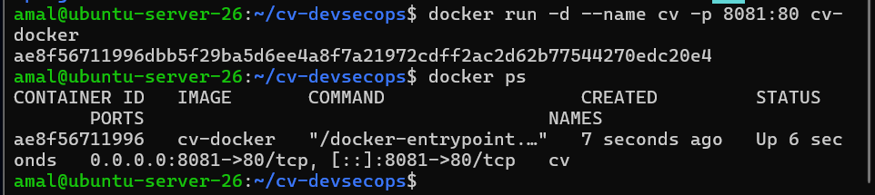

Accès depuis la machine physique : `http://localhost:8081` (redirection de port VirtualBox 8081 → 8081 de la VM).

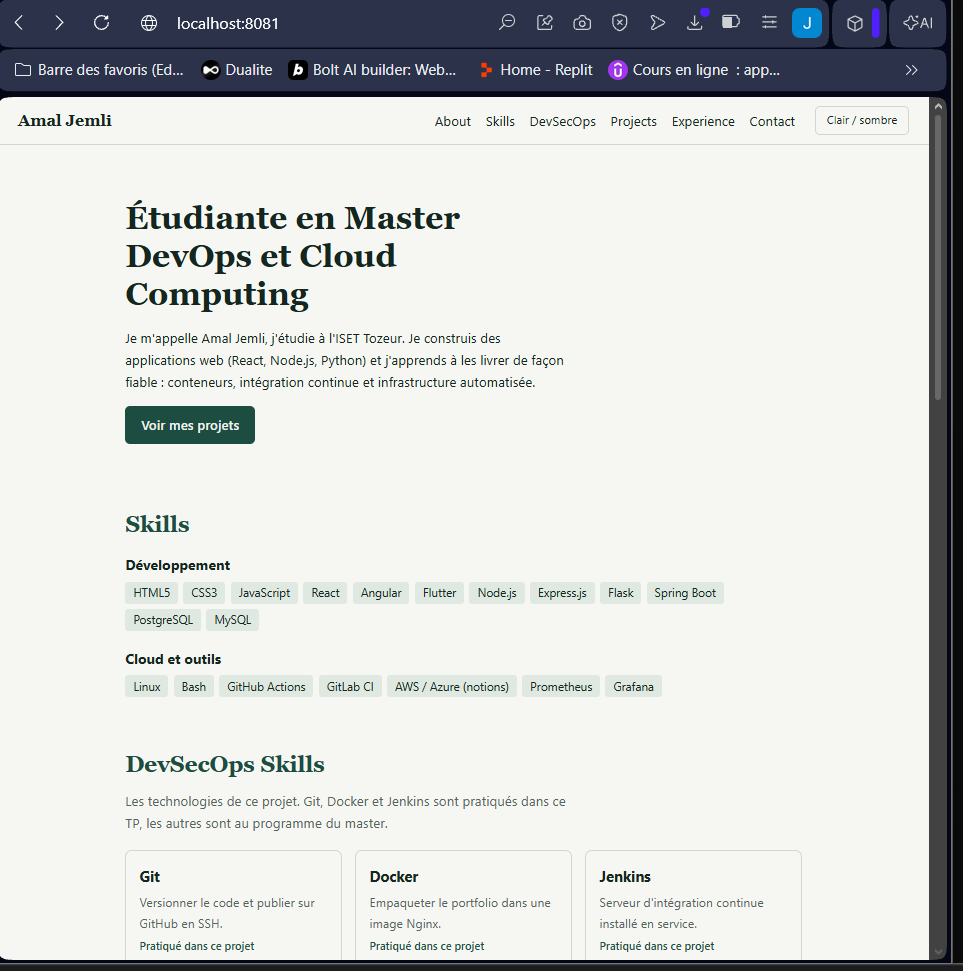

Preuve que c'est bien Nginx qui répond (version et journaux d'accès du conteneur) :

```bash
docker exec cv nginx -v
docker logs --tail 5 cv
```

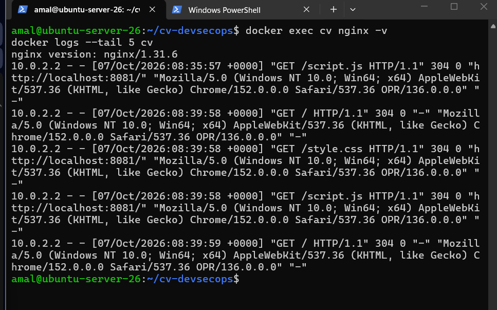

En-tête de réponse HTTP vu dans les outils du navigateur (`Server: nginx/1.31.6`) :

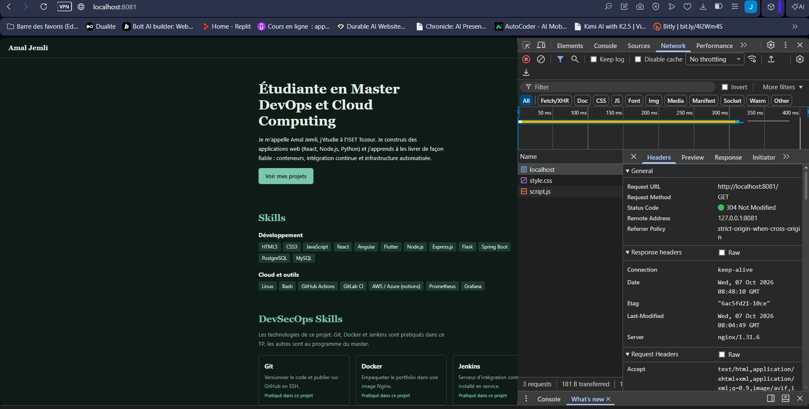

## Étape 13 – Déploiement avec Docker Compose

Fichier `docker-compose.yml` :

```yaml
services:
  cv:
    build: .
    image: cv-docker
    container_name: cv-compose
    ports:
      - "8081:80"
    restart: unless-stopped
```

Le conteneur de l'étape 12 est d'abord supprimé pour libérer le port 8081, puis le service est lancé :

```bash
docker rm -f cv
docker compose up -d
docker compose ps
```

`restart: unless-stopped` relance le conteneur après un redémarrage de la VM.

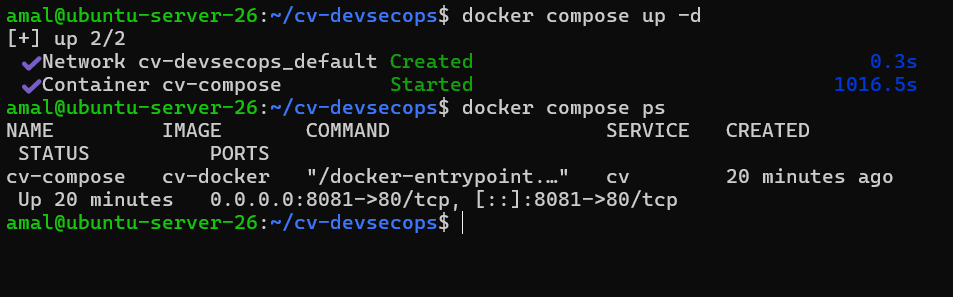

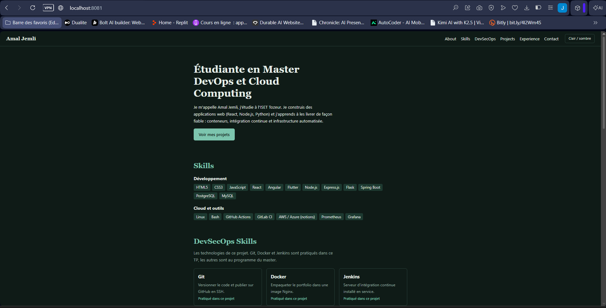

## Étape 14 – Publication sur GitHub via SSH

Dépôt GitHub mis à jour : https://github.com/Amal356/cv-devsecops

Commandes Git utilisées dans la VM :

```bash
cd ~/cv-devsecops
git status
git add .
git commit -m "Dockerisation : Dockerfile, docker-compose et documentation"
git push
git log --oneline
```

Le dépôt distant utilise SSH (`git@github.com:Amal356/cv-devsecops.git`), configuré à l'étape 6 : aucun mot de passe n'est demandé au push.

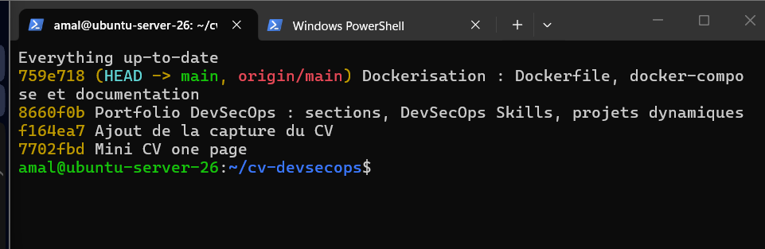

Contenu du dépôt sur GitHub après le push :

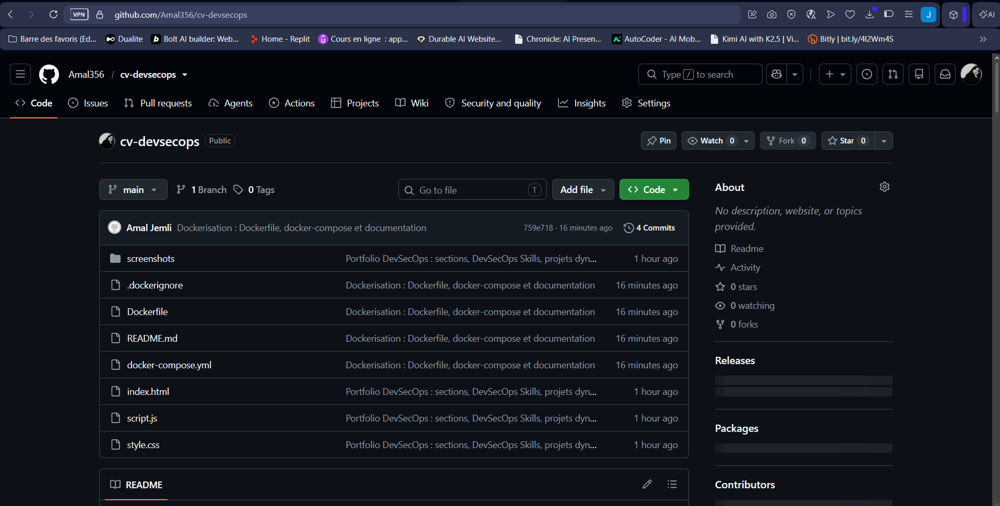
