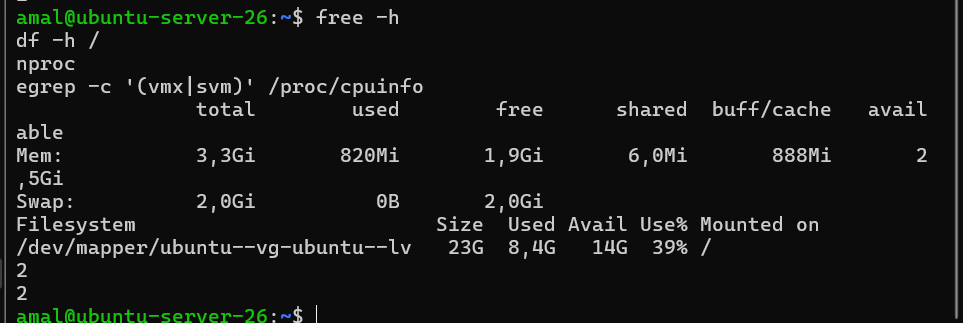
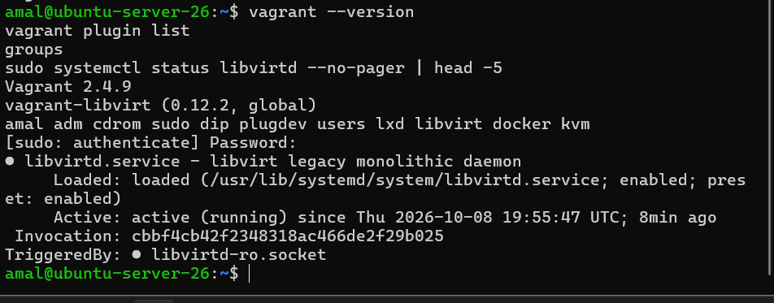
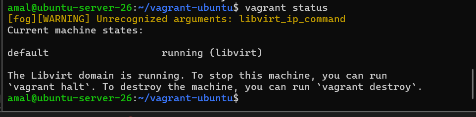
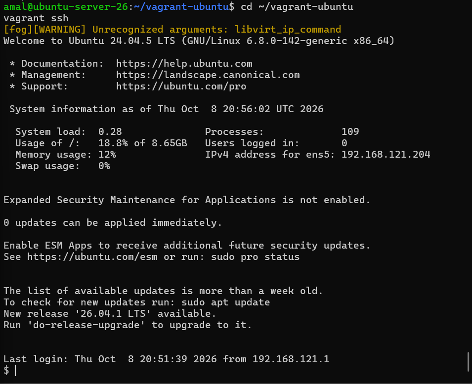
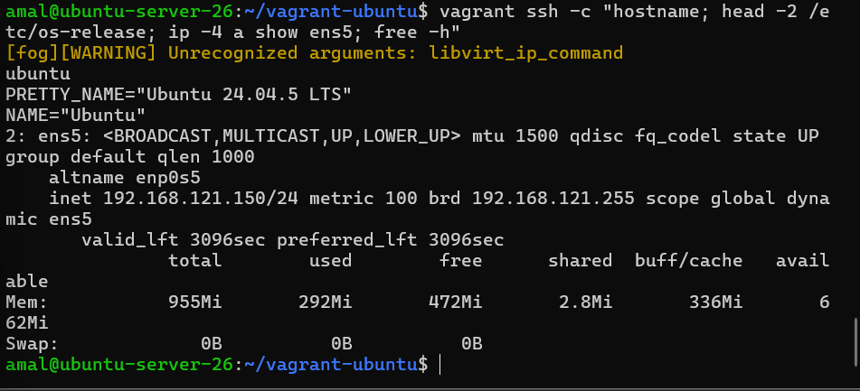
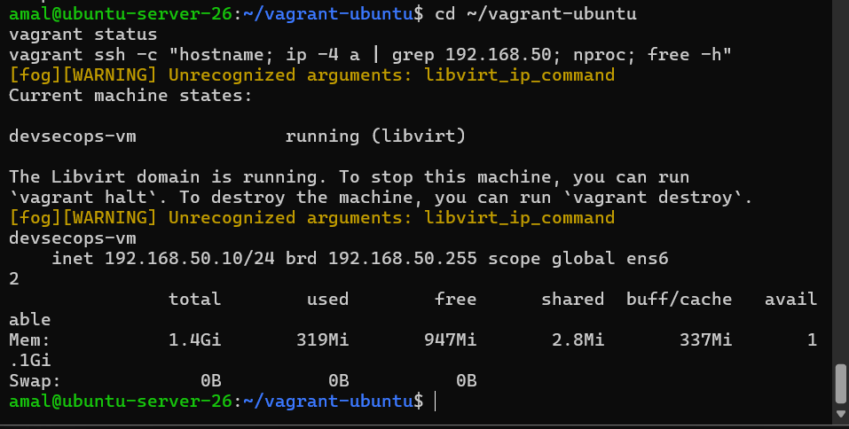

# DevSecOps Portfolio – Amal Jemli

Dépôt GitHub : https://github.com/Amal356/cv-devsecops

## Sommaire

- [Étape 1 – Ubuntu Server 26.04 et accès SSH sécurisé](01-ubuntu-ssh/README.md)
- [Étape 2 – Test SSH depuis la machine physique](02-test-ssh/README.md)
- [Étape 3 – Installation de Docker](03-docker/README.md)
- [Étape 4 – Installation de Jenkins](04-jenkins/README.md)
- Étapes 5 et 7 à 14 – Portfolio et Docker : ci-dessous
- [Étape 6 – Push GitHub via SSH](06-github-ssh/README.md)
- [Étapes 15 à 17 – Vagrant](07-vagrant/README.md)

Le mini CV de l'étape 5 a évolué en petite application de portfolio (HTML5, CSS3, JavaScript).

## Étape 5 – Mini CV One Page


## Étape 7 – Évolution vers un DevSecOps Portfolio

Sections : **About, Skills, DevSecOps Skills, Projects, Experience, Contact**.

Principales améliorations :

- barre de navigation fixe avec liens d'ancrage vers chaque section et défilement doux ;
- page découpée en sections au lieu d'un CV en deux colonnes ;
- thème clair / sombre, mémorisé dans le navigateur, qui suit aussi la préférence du système ;
- mise en page adaptée aux petits écrans (responsive) ;
- contenu des projets séparé de la mise en page, dans le code JavaScript.


## Étape 8 – Section DevSecOps Skills

Technologies du projet : Git, Docker, Jenkins, Kubernetes, Ansible, Terraform, Argo CD.
Git, Docker et Jenkins sont marqués « Pratiqué dans ce projet », les autres « Au programme ».


## Étape 9 – Projects générés dynamiquement en JavaScript

Les projets sont décrits dans un tableau d'objets, puis la page est construite par une fonction :

```javascript
const projets = [
  {
    titre: "Plateforme d'analyse des réservations",
    periode: "2025 · Desert Navigation",
    description: "Analyse des réservations Airbnb et Booking ...",
    technologies: ["Python", "PostgreSQL", "React", "Node.js", "JWT"]
  },
  // ...
];

function creerProjet(p) {
  const bloc = document.createElement("article");
  const titre = document.createElement("h3");
  titre.textContent = p.titre;
  // ... description, technologies, lien
  bloc.append(titre /* ... */);
  return bloc;
}

document.getElementById("project-list").append(...projets.map(creerProjet));
```

Ajouter un projet revient à ajouter un objet au tableau.


## Étape 10 – Dockerfile (Nginx)

Fichier `Dockerfile` à la racine du projet :

```dockerfile
# Image officielle Nginx, version légère (Alpine Linux)
FROM nginx:alpine

# Copie du site statique dans le dossier servi par Nginx
COPY index.html style.css script.js /usr/share/nginx/html/

# Nginx écoute sur le port 80 dans le conteneur
EXPOSE 80
```

Explication :

- `FROM nginx:alpine` : l'image de départ est Nginx sur Alpine Linux, une base très légère (quelques dizaines de Mo).
- `COPY ...` : les trois fichiers du portfolio sont copiés dans `/usr/share/nginx/html/`, le dossier que Nginx sert par défaut. Le portfolio est un site statique, il n'y a donc rien à compiler.
- `EXPOSE 80` : indique que le conteneur écoute sur le port 80. La publication vers la machine se fait ensuite avec `-p` ou Docker Compose.

Un fichier `.dockerignore` exclut du build ce qui n'est pas utile au site (`.git`, `screenshots`, `README.md`, `Dockerfile`, `docker-compose.yml`).


## Étape 11 – Construction de l'image `cv-docker`

```bash
docker build -t cv-docker .
docker images
```

`-t cv-docker` donne le nom `cv-docker` à l'image (tag `latest` par défaut) et `.` indique que le contexte de build est le dossier courant.


## Étape 12 – Exécution du conteneur

```bash
docker run -d --name cv -p 8081:80 cv-docker
docker ps
```

- `-d` : le conteneur tourne en arrière-plan ;
- `--name cv` : nom du conteneur ;
- `-p 8081:80` : le port 8081 de la VM est relié au port 80 de Nginx dans le conteneur.

Résultat de `docker ps` :

```
CONTAINER ID   IMAGE       COMMAND                  CREATED         STATUS         PORTS                                         NAMES
ae8f56711996   cv-docker   "/docker-entrypoint.…"   7 seconds ago   Up 6 seconds   0.0.0.0:8081->80/tcp, [::]:8081->80/tcp       cv
```


Accès depuis la machine physique : `http://localhost:8081` (redirection de port VirtualBox 8081 → 8081 de la VM).


Preuve que c'est bien Nginx qui répond (version et journaux d'accès du conteneur) :

```bash
docker exec cv nginx -v
docker logs --tail 5 cv
```


En-tête de réponse HTTP vu dans les outils du navigateur (`Server: nginx/1.31.6`) :


## Étape 13 – Déploiement avec Docker Compose

Fichier `docker-compose.yml` :

```yaml
services:
  cv:
    build: .
    image: cv-docker
    container_name: cv-compose
    ports:
      - "8081:80"
    restart: unless-stopped
```

Le conteneur de l'étape 12 est d'abord supprimé pour libérer le port 8081, puis le service est lancé :

```bash
docker rm -f cv
docker compose up -d
docker compose ps
```

`restart: unless-stopped` relance le conteneur après un redémarrage de la VM.


## Étape 14 – Publication sur GitHub via SSH

Dépôt GitHub mis à jour : https://github.com/Amal356/cv-devsecops

Commandes Git utilisées dans la VM :

```bash
cd ~/cv-devsecops
git status
git add .
git commit -m "Dockerisation : Dockerfile, docker-compose et documentation"
git push
git log --oneline
```

Le dépôt distant utilise SSH (`git@github.com:Amal356/cv-devsecops.git`), configuré à l'étape 6 : aucun mot de passe n'est demandé au push.


Contenu du dépôt sur GitHub après le push :


---

## Partie IV – Première introduction à l'automatisation (Vagrant)

Vagrant est installé **dans la VM Ubuntu Server** (VirtualBox sur la machine physique Windows) et crée une seconde VM Ubuntu automatiquement : c'est de la virtualisation imbriquée.

## Prérequis : ressources et virtualisation

Sur la machine physique (VM éteinte), la virtualisation imbriquée est activée et la VM reçoit 4 Go de RAM :

```powershell
VBoxManage modifyvm "ubuntu-server-26" --nested-hw-virt on --memory 4096 --cpus 2
```

Windows utilisait la sécurité basée sur la virtualisation (**Intégrité de la mémoire**), qui lançait l'hyperviseur Hyper-V et empêchait VirtualBox de transmettre la virtualisation matérielle à la VM. Elle a été désactivée dans Sécurité Windows (Isolation du noyau), suivie d'un redémarrage.

Vérification dans la VM Ubuntu :

```bash
free -h
df -h /
nproc
egrep -c '(vmx|svm)' /proc/cpuinfo
```

Résultat : 3,3 Go de RAM, 14 Go libres, 2 CPU, et `egrep` affiche `2`. Le processeur est un **AMD** : il s'agit donc de l'extension `svm`.



## Étape 15 – Installation de Vagrant et premier Vagrantfile

### Installation

Sous Ubuntu 26.04, `vagrant` et `vagrant-libvirt` ne sont pas disponibles dans les dépôts Ubuntu. QEMU et libvirt sont installés avec les paquets Ubuntu, Vagrant avec le dépôt officiel HashiCorp, et le plugin libvirt avec la commande `vagrant plugin` :

```bash
sudo apt install -y qemu-system-x86 libvirt-daemon-system libvirt-clients libvirt-dev build-essential pkg-config libxml2-dev libxslt1-dev zlib1g-dev ovmf
wget -O - https://apt.releases.hashicorp.com/gpg | sudo gpg --dearmor -o /usr/share/keyrings/hashicorp-archive-keyring.gpg
echo "deb [signed-by=/usr/share/keyrings/hashicorp-archive-keyring.gpg] https://apt.releases.hashicorp.com noble main" | sudo tee /etc/apt/sources.list.d/hashicorp.list
sudo apt update
sudo apt install -y vagrant
vagrant plugin install vagrant-libvirt
sudo usermod -aG libvirt,kvm $USER
```

Après une déconnexion/reconnexion (pour que les nouveaux groupes soient pris en compte), vérification :

```bash
vagrant --version
vagrant plugin list
groups
sudo systemctl status libvirtd --no-pager | head -5
```

Résultat : Vagrant 2.4.9, plugin `vagrant-libvirt` 0.12.2, utilisateur dans les groupes `libvirt` et `kvm`, service `libvirtd` actif.



### Vagrantfile utilisé

```ruby
Vagrant.configure("2") do |config|
  config.vm.box = "cloud-image/ubuntu-24.04"
  config.vm.boot_timeout = 900

  config.vm.provider "libvirt" do |lv|
    lv.driver = "qemu"
    lv.cpu_mode = "custom"
    lv.cpu_model = "qemu64"
    lv.memory = 1024
    lv.loader = "/usr/share/ovmf/OVMF.fd"
  end
end
```

- `config.vm.box` : image de base (« box ») Ubuntu 24.04, téléchargée depuis le catalogue Vagrant.
- `config.vm.boot_timeout` : délai d'attente du démarrage, augmenté car l'émulation est lente.
- `lv.driver = "qemu"` : émulation logicielle, sans KVM.
- `lv.cpu_mode` / `lv.cpu_model` : processeur virtuel générique, compatible avec l'émulation.
- `lv.memory = 1024` : 1 Go de RAM pour la VM.
- `lv.loader` : firmware UEFI (OVMF) utilisé pour le démarrage.

### Création de la VM

```bash
mkdir -p ~/vagrant-ubuntu && cd ~/vagrant-ubuntu
vagrant up --provider=libvirt
vagrant status
```

Vagrant télécharge la box, crée la VM dans libvirt, la démarre, attend qu'elle obtienne une adresse IP (ici `192.168.121.150`), puis configure l'accès SSH avec une clé générée automatiquement. `vagrant status` affiche `default  running (libvirt)`.



### Problèmes rencontrés

1. **KVM imbriqué fait planter VirtualBox** : avec `lv.driver = "kvm"`, la VM Ubuntu s'arrêtait en « guru meditation » (`VERR_SVM_UNKNOWN_EXIT` dans `VBox.log`). VirtualBox gère mal la virtualisation imbriquée sur processeur AMD. Solution : émulation logicielle avec `lv.driver = "qemu"` (plus lent, mais stable).

2. **« No bootable device »** : `vagrant up` restait bloqué sur `Waiting for domain to get an IP address...`. Une capture de l'écran de la VM a montré qu'elle ne trouvait aucun système à démarrer :

   ```bash
   virsh -c qemu:///system screenshot vagrant-ubuntu_default ~/screen.png
   ```

   L'inspection de l'image de la box a montré que son premier secteur était rempli de zéros : la box téléchargée était abîmée.

   ```bash
   qemu-io -r -f qcow2 -c "read -v 448 64" ~/.vagrant.d/boxes/cloud-image-VAGRANTSLASH-ubuntu-24.04/20260926.0.0/amd64/libvirt/box.img
   ```

   Solution : supprimer la box et sa copie dans le stockage libvirt, puis la retélécharger avec `vagrant up`. Après le nouveau téléchargement, le secteur se termine bien par la signature `55 aa` et la VM démarre.

   ```bash
   vagrant destroy -f
   virsh -c qemu:///system vol-delete --pool default cloud-image-VAGRANTSLASH-ubuntu-24.04_vagrant_box_image_20260926.0.0_box.img
   vagrant box remove cloud-image/ubuntu-24.04 --all --force
   vagrant up --provider=libvirt
   ```

3. **Démarrage UEFI** : la VM démarre avec le firmware UEFI OVMF (paquet `ovmf`), déclaré dans le Vagrantfile avec `lv.loader`.

## Étape 16 – Connexion avec vagrant ssh

Depuis la VM Ubuntu Server, dans le dossier du Vagrantfile :

```bash
cd ~/vagrant-ubuntu
vagrant ssh
```

On est alors connecté à la VM créée par Vagrant (utilisateur `vagrant`), sans mot de passe ni configuration de clé à faire soi-même. On en sort avec `exit`.



`vagrant ssh -c` permet aussi d'exécuter des commandes dans la VM sans ouvrir de session :

```bash
vagrant ssh -c "hostname; head -2 /etc/os-release; ip -4 a show ens5; free -h"
```

Résultat : nom d'hôte `ubuntu` (valeur par défaut de la box), Ubuntu 24.04.5 LTS, adresse `192.168.121.150` sur l'interface `ens5` (attribuée automatiquement par le réseau de gestion de vagrant-libvirt) et 955 Mi de RAM, pour 1 Go demandé dans le Vagrantfile.



### Comparaison avec la création manuelle de la VM

| | VM manuelle (VirtualBox) | VM Vagrant |
|---|---|---|
| Création | Assistant VirtualBox, ISO, installation d'Ubuntu pas à pas | Une commande : `vagrant up` |
| Configuration | Clics dans l'interface, difficile à reproduire à l'identique | Décrite dans un fichier texte (`Vagrantfile`), versionné avec Git |
| Accès SSH | Redirection de port, création et copie de la clé à la main | `vagrant ssh` : clé générée et configurée automatiquement |
| Reproductibilité | Il faut tout refaire à la main | `vagrant destroy` puis `vagrant up` recrée la même VM |
| Partage | Exporter une image lourde (.ova) | Partager le `Vagrantfile` (quelques lignes) |

Vagrant applique le principe de l'**Infrastructure as Code** : la VM est décrite par du code, ce qui la rend reproductible, versionnable et rapide à recréer.

## Étape 17 – Configuration automatique : nom, IP privée, mémoire, CPU

Le Vagrantfile est modifié pour décrire précisément la VM. Le nom de la machine changeant, l'ancienne VM est d'abord supprimée :

```bash
cd ~/vagrant-ubuntu
vagrant destroy -f
```

### Vagrantfile final

```ruby
Vagrant.configure("2") do |config|
  config.vm.box = "cloud-image/ubuntu-24.04"
  config.vm.boot_timeout = 900

  config.vm.define "devsecops-vm" do |vm|
    vm.vm.hostname = "devsecops-vm"
    vm.vm.network "private_network", ip: "192.168.50.10"

    vm.vm.provider "libvirt" do |lv|
      lv.default_prefix = ""
      lv.driver = "qemu"
      lv.cpu_mode = "custom"
      lv.cpu_model = "qemu64"
      lv.memory = 1536
      lv.cpus = 2
      lv.loader = "/usr/share/ovmf/OVMF.fd"
    end
  end
end
```

| Paramètre demandé | Ligne du Vagrantfile | Valeur |
|---|---|---|
| Nom de la VM | `config.vm.define` + `lv.default_prefix = ""` | `devsecops-vm` (dans Vagrant et dans libvirt) |
| Nom d'hôte | `vm.vm.hostname` | `devsecops-vm` |
| Adresse IP privée | `vm.vm.network "private_network"` | `192.168.50.10` |
| Mémoire | `lv.memory` | 1536 Mo |
| Nombre de CPU | `lv.cpus` | 2 |

### Création et vérification

```bash
vagrant up --provider=libvirt
vagrant status
vagrant ssh -c "hostname; ip -4 a | grep 192.168.50; nproc; free -h"
```

Résultat de `vagrant status` :

```
Current machine states:

devsecops-vm              running (libvirt)
```

Vérification dans la VM :

- `hostname` → `devsecops-vm`
- `ip -4 a` → `inet 192.168.50.10/24` sur l'interface `ens6`, ajoutée pour le réseau privé
- `nproc` → `2`
- `free -h` → 1,4 Gi de mémoire totale (1536 Mo, moins la part réservée par le noyau)

Par rapport au premier Vagrantfile de l'étape 15 (nom `ubuntu`, une seule adresse attribuée automatiquement, 955 Mi de RAM, 1 CPU), toute la configuration demandée est appliquée automatiquement au démarrage, sans aucune intervention manuelle.


